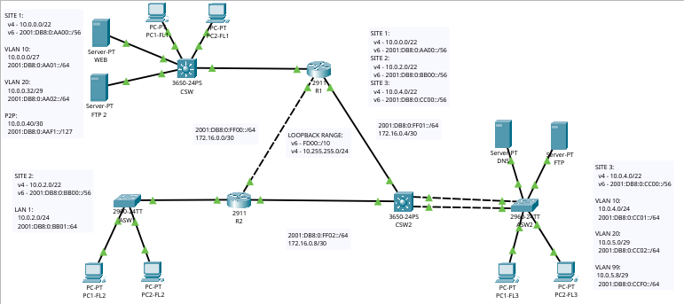

# IPv6 Enterprise Lab – Dual Stack Network (Cisco)

This project demonstrates the implementation of an enterprise-style dual-stack network (IPv4 + IPv6) using Cisco technologies. The lab simulates multiple sites interconnected through OSPF and OSPFv3, including DHCP services, VLAN segmentation, and IPv6 addressing.

Key Concepts Demonstrated:

- IPv4 / IPv6 Dual Stack
- VLAN segmentation
- Inter-VLAN routing
- DHCPv4
- DHCPv6
- OSPF (IPv4)
- OSPFv3 (IPv6)
- Static routing
- Link-local IPv6 addressing
- Multisite network design

## The topology simulates three interconnected sites

- Site 1

  - VLAN10 – User network
  - VLAN20 – Server network
  - DHCPv4 + DHCPv6 services
  - Layer 3 Switch (CSW1)

- Site 2

  - Access switch
  - End-user network
  - Routed through R2

- Site 3

  - Server infrastructure
  - DNS / FTP servers
  - Layer 3 switching

Routers connect sites using **OSPF (IPv4)** and **OSPFv3 (IPv6)**.

## Network Design

Prefix given to each site:

| Network | IPv6 Prefix          | IPv4 Prefix |
| ------- | -------------------- | ----------- |
| SITE 1  | 2001:DB8:0:AA00::/56 | 10.0.0.0/22 |
| SITE 2  | 2001:DB8:0:BB00::/56 | 10.0.2.0/22 |
| SITE 3  | 2001:DB8:0:CC00::/56 | 10.0.4.0/22 |

Each site uses /64 subnets, following IPv6 best practices.

Site 1

| Network  | IPv6 Prefix          | IPv4 Prefix  |
| -------- | -------------------- | ------------ |
| VLAN10   | 2001:DB8:0:AA01::/64 | 10.0.0.0/27  |
| VLAN20   | 2001:DB8:0:AA02::/64 | 10.0.0.32/29 |
| P2P Link | 2001:DB8:0:AAF1::/64 | 10.0.0.40/30 |

Site 2

| Network | IPv6 Prefix          | IPv4 Prefix |
| ------- | -------------------- | ----------- |
| LAN 1   | 2001:DB8:0:BB01::/64 | 10.0.2.0/24 |

Site 3

| Network | IPv6 Prefix          | IPv4 Prefix |
| ------- | -------------------- | ----------- |
| VLAN10  | 2001:DB8:0:CC01::/64 | 10.0.4.0/24 |
| VLAN20  | 2001:DB8:0:CC02::/64 | 10.0.5.0/29 |
| VLAN99  | 2001:DB8:0:CCF0::/64 | 10.0.5.8/29 |

Link-local addresses are manually configured to maintain deterministic routing.
